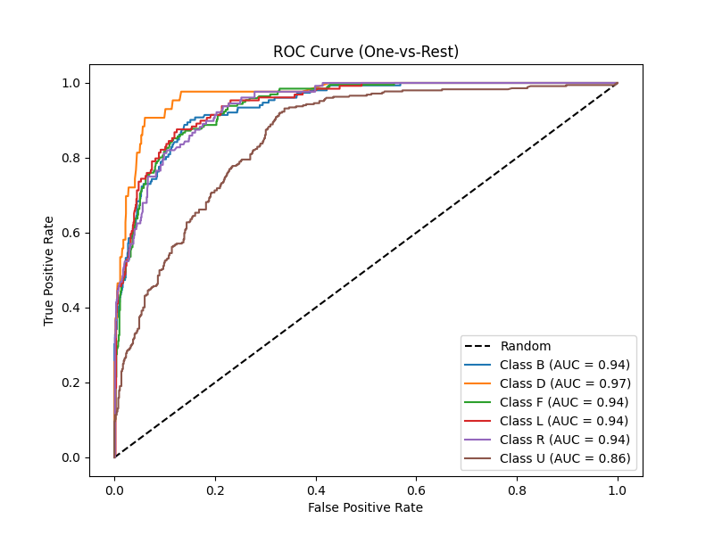
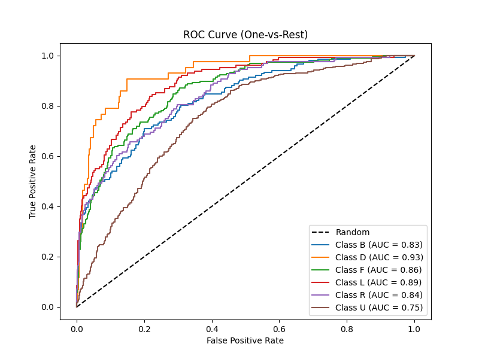
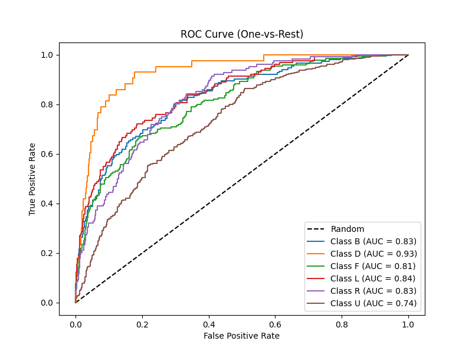

## Random Forest

Best parameters:
- n_estimators: 400
- min_samples_split: 2
- min_samples_leaf: 1
- max_features: "sqrt"
- max_depth: 20
- class_weight: "balanced"

F1 score: 0.6534

AUC score: 0.9313

## MLP (plain)

Best parameters:
- activation: "relu"
- alpha: 0.02753
- hidden_layer_sizes: (1024, 512, 256)
- learning_rate: "constant"
- learning_rate_init: 0.0001349
- max_iter: 500
- solver: "adam"
- validation_fraction: 0.1

F1 score: 0.5214

AUC score: 0.8522

## Encoder + Random forest

Latent space: 32

Best parameters:
- n_estimators: 300
- min_samples_split: 5
- min_samples_leaf: 1
- max_features: "sqrt"
- max_depth: 20
- class_weight: "balanced"

F1 score: 0.5097

AUC Score: 0.8300